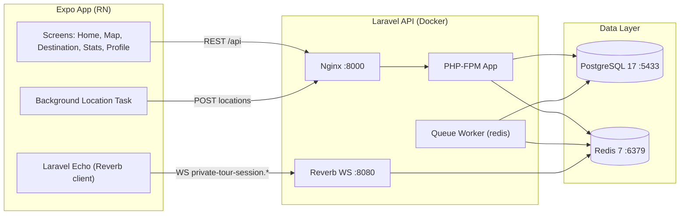

# 🏍️ Tikum — Aplikasi Touring dengan Live Tracking & SOS Alert

[](https://expo.dev)
[](https://reactnative.dev)
[](https://laravel.com)
[](https://www.postgresql.org)
[](https://redis.io)
[](https://laravel.com/docs/reverb)
[](https://docs.docker.com/compose/)

> **English summary:**
> Tikum is a touring companion app for riding communities. Users create trip rooms, invite members via PIN, track the convoy's live positions on the map, and broadcast SOS alerts in emergencies. Built with an Expo (React Native) mobile frontend and a Laravel 13 REST + WebSocket backend (PostgreSQL 17, Redis 7, Reverb), fully containerized with Docker Compose.

---

## Daftar Isi

1. [Tentang Proyek](#1-tentang-proyek)
2. [Tabel Fitur](#2-tabel-fitur)
3. [Tabel Tech Stack](#3-tabel-tech-stack)
4. [Diagram Arsitektur](#4-diagram-arsitektur)
5. [Alur Bisnis End-to-End](#5-alur-bisnis-end-to-end)
6. [Status & State Machine](#6-status--state-machine)
7. [Model Data & Relasi](#7-model-data--relasi)
8. [API Reference](#8-api-reference)
9. [Cara Menjalankan Lokal](#9-cara-menjalankan-lokal)
10. [Deploy & Struktur Folder](#10-deploy--struktur-folder)
11. [Catatan Keamanan & Batasan](#11-catatan-keamanan--batasan)

---

## 1. Tentang Proyek

Tikum adalah aplikasi mobile untuk komunitas touring motor: satu room merepresentasikan satu rombongan perjalanan. Host membuat room dan membagikan PIN, anggota bergabung, dan selama sesi aktif posisi tiap anggota terpantau real-time di peta. Jika terjadi keadaan darurat, anggota dapat memicu SOS alert yang ter-broadcast ke seluruh anggota room. Setelah perjalanan selesai, host menutup room dan riwayat perjalanan tersimpan untuk dilihat kembali beserta statistiknya.

**Alur bisnis utama: Register/Login → Buat/Gabung room via PIN → Live tracking di peta selama sesi aktif → SOS jika darurat → Tutup room → Lihat riwayat & statistik.**

---

## 2. Tabel Fitur

### A. Autentikasi & Akun

| Fitur | Layar | Keterangan |
| :--- | :--- | :--- |
| Register & Login | `Login` / `Register` | Registrasi, login, lupa & reset password via API Sanctum |
| Profil & Avatar | `Profile` | Lihat/ubah profil, upload foto avatar |
| Pengaturan & Bahasa | `Settings` | Pengaturan aplikasi, bilingual Indonesia/Inggris |

### B. Room & Trip Session

| Fitur | Layar | Keterangan |
| :--- | :--- | :--- |
| Buat Room | `Home` → CreateRoomModal | Host membuat room baru + trip session aktif |
| Gabung via PIN | `Home` → JoinRoomModal | Anggota bergabung dengan PIN room |
| Daftar Anggota | Room detail | Anggota aktif room + peran host/member |
| Keluar / Tutup Room | Room detail | Anggota leave; host menutup room yang sedang aktif |
| Trip Aktif | `Home` → ActiveTripsCard | Daftar sesi perjalanan yang sedang berjalan |

### C. Peta, Tracking & SOS

| Fitur | Layar | Keterangan |
| :--- | :--- | :--- |
| Peta Live | `Map` | Posisi anggota rombongan real-time (MapLibre) |
| Rute & Destinasi | `Destination` | Pencarian lokasi + rute perjalanan (OSRM) |
| Background Location | — | Tracking lokasi berjalan di background via task manager |
| SOS Alert | `Map` | Picu SOS → broadcast ke anggota; resolve saat aman |
| Riwayat & Statistik | `Home` (HistoryModal) / `Stats` | Histori trip + statistik touring pengguna |

---

## 3. Tabel Tech Stack

| Lapisan | Teknologi | Catatan |
| :--- | :--- | :--- |
| Mobile | Expo ~54, React 19, React Native 0.81 | `expo-router`, React Navigation (stack + bottom-tabs) |
| Peta & Lokasi | MapLibre, react-native-maps, expo-location, expo-task-manager | Live map + background location tracking |
| Realtime (FE) | laravel-echo + pusher-js | Subscribe channel `private-tour-session.{id}` via Reverb |
| Penyimpanan (FE) | expo-secure-store + AsyncStorage | Token sesi & preferensi |
| Backend | Laravel 13 (PHP 8.3), Sanctum | REST API + auth token di `routes/api.php` |
| Realtime (BE) | Laravel Reverb | WebSocket server port `8080` |
| Database | PostgreSQL 17 | Skema relasional room/session/location/SOS |
| Cache & Queue | Redis 7 | `CACHE_STORE` + `QUEUE_CONNECTION` + queue worker |
| Web Server | Nginx 1.27 | Reverse proxy ke PHP-FPM, expose port `8000` |
| Infra | Docker Compose | Service `app`, `nginx`, `postgres`, `redis`, `queue`, `reverb` |

---

## 4. Diagram Arsitektur



---

## 5. Alur Bisnis End-to-End

1. **Register & Login**
   Anggota mendaftar dan masuk. Token Sanctum disimpan aman di device (`expo-secure-store`).
   - Endpoint: `POST /api/register`, `POST /api/login`

2. **Buat / Gabung Room**
   Host membuat room (otomatis membuka trip session aktif). Anggota bergabung dengan PIN.
   - Endpoint: `POST /api/rooms`, `POST /api/rooms/join`

3. **Live Tracking**
   Aplikasi mengirim lokasi berkala (termasuk background task) dan menerima posisi anggota lain via WebSocket channel privat per session. Otorisasi channel hanya untuk member aktif.
   - Endpoint: `POST /api/tour-sessions/{session}/locations/current`, `GET /api/tour-sessions/{session}/locations/current`
   - Channel: `private-tour-session.{sessionId}`

4. **SOS Darurat**
   Anggota memicu SOS yang tercatat aktif dan ter-broadcast; setelah aman, SOS di-resolve.
   - Endpoint: `POST /api/tour-sessions/{session}/sos`, `POST /api/tour-sessions/{session}/sos/{sosAlert}/resolve`

5. **Tutup Room & Riwayat**
   Host menutup room (`closed`); trip masuk riwayat dan statistik pengguna.
   - Endpoint: `POST /api/rooms/{room}/close`, `GET /api/history/trips`

---

## 6. Status & State Machine

**Room:** `[ active ]` ---> `[ closed ]`
- `active`: default saat room dibuat; anggota bisa join, tracking & SOS berjalan.
- `closed`: set oleh host; room tidak lagi menerima aktivitas.

**Room member:** `[ active ]` ---> `(left)` — keluar via leave; join ulang mengaktifkan kembali.

**Tour session:** mengikuti room — `active` selama perjalanan berlangsung.

**SOS alert:** `[ active ]` ---> `[ resolved ]`
- `active`: saat SOS dipicu; hanya satu SOS aktif yang diproses per alert.
- `resolved`: setelah dikonfirmasi aman via endpoint resolve.

---

## 7. Model Data & Relasi

Relasi (lihat `backend/database/migrations/`):

```
User 1—1 Profile
User 1—N Room (host) • User N—M Room via room_members
Room 1—N RoomTrip • Room 1—1 TourSession (active)
TourSession 1—N TourSessionMember (user)
TourSession 1—N CurrentLocation + LocationHistory
TourSession 1—N SosAlert
```

| Tabel | Kolom kunci |
|---|---|
| `users` | `id`, `name`, `email`, `password` (+ `profiles`: data pelengkap & avatar) |
| `rooms` | `id`, `host_id`, `pin`, `status` (`active`/`closed`), `closed_at` |
| `room_members` | `room_id`, `user_id`, `role` (`host`/`member`), `status`, `joined_at`, `left_at` |
| `room_trips` | `room_id`, data tiap trip dalam room |
| `tour_sessions` | `room_id`, `status` (`active`), periode sesi live |
| `tour_session_members` | `session_id`, `user_id`, `role`, `status` |
| `current_locations` | posisi terakhir tiap member per session |
| `location_histories` | jejak lokasi untuk riwayat rute |
| `sos_alerts` | `session_id`, `user_id`, `status` (`active`/`resolved`) |
| Sistem Laravel | `personal_access_tokens`, `cache`, `jobs`, `sessions`, `password_reset_tokens` |

---

## 8. API Reference

Base URL lokal: `http://localhost:8000/api`. Semua kode di `backend/routes/api.php`.

| Method & Endpoint | Fungsi |
|---|---|
| `GET /api/health` | Cek status API |
| `POST /api/register` | Registrasi pengguna baru |
| `POST /api/login` | Login → token Sanctum |
| `POST /api/forgot-password` | Minta link reset password |
| `POST /api/reset-password` | Reset password |
| `POST /api/logout` | Logout (auth) |
| `GET /api/me` | Profil user login (auth) |
| `GET /api/profile` | Detail profil (auth) |
| `PUT /api/profile` | Update profil (auth) |
| `POST /api/profile/avatar` | Upload avatar (auth) |
| `GET /api/rooms/active` | Room aktif user (auth) |
| `POST /api/rooms` | Buat room + session (auth, host) |
| `POST /api/rooms/join` | Gabung room via PIN (auth) |
| `POST /api/rooms/{room}/leave` | Keluar room (auth) |
| `POST /api/rooms/{room}/close` | Tutup room (auth, host) |
| `GET /api/rooms/{room}` | Detail room (auth, member) |
| `GET /api/rooms/{room}/members` | Anggota room (auth, member) |
| `GET /api/rooms/{room}/trip` | Trip room (auth, member) |
| `GET /api/tour-sessions/{session}/locations/current` | Posisi terkini anggota (auth) |
| `POST /api/tour-sessions/{session}/locations/current` | Update posisi (auth) |
| `POST /api/tour-sessions/{session}/sos` | Picu SOS (auth) |
| `POST /api/tour-sessions/{session}/sos/{sosAlert}/resolve` | Resolve SOS (auth) |
| `GET /api/history/trips` | Riwayat trip (auth) |
| `GET /api/history/trips/{session}` | Detail trip (auth) |
| `POST /api/broadcasting/auth` | Otorisasi channel privat Reverb (auth, member aktif) |

---

## 9. Cara Menjalankan Lokal

### Prasyarat

- Docker & Docker Compose (untuk backend)
- Node.js LTS + npm (untuk mobile)
- Aplikasi **Expo Go** di HP, atau Android emulator / dev client (background location butuh dev client untuk build penuh)

### 9.1 Backend (Docker, port `8000`)

```bash
# 1. Clone repository
git clone https://github.com/trezaluginap/Tikum.git
cd Tikum

# 2. Siapkan env backend
cp backend/.env.example backend/.env
# Isi APP_KEY:
docker compose run --rm app php artisan key:generate

# 3. Jalankan semua service
docker compose up -d --build

# 4. Migrasi database
docker compose exec app php artisan migrate

# 5. Cek kesehatan
curl http://localhost:8000/api/health
docker compose ps
```

Service lokal:

| Service | Alamat |
|---|---|
| API via Nginx | `http://localhost:8000` |
| PostgreSQL | host `127.0.0.1` port `5433` (db `tikum` / user `tikum`) |
| Redis | `127.0.0.1:6379` |
| Reverb WS | `http://localhost:8080` |

Perintah berguna:

```bash
docker compose exec app php artisan test          # testing
docker compose exec redis redis-cli ping          # cek Redis → PONG
docker compose logs queue                         # log queue worker
docker compose logs reverb                        # log websocket
```

> **PENTING:** Jangan pernah meng-commit file `.env` / `backend/.env` yang berisi kredensial asli. Volume `tikum_postgres_data` menyimpan data lokal — jangan dihapus bila ingin mempertahankan data.

### 9.2 Mobile (Expo)

```bash
npm install
npx expo start
```

Lalu pilih `a` (Android), `i` (iOS), `w` (web), atau scan QR dengan Expo Go. Arahkan base URL API di `src/api/client.js` ke `http://<IP-LAN>:8000/api` saat running di HP fisik (localhost HP ≠ localhost laptop).

---

## 10. Deploy & Struktur Folder

### Pola Deployment Disarankan

- **Backend:** VPS (Ubuntu + Docker Compose) — service yang sama seperti lokal; pasang reverse proxy + TLS di depan Nginx bila perlu.
- **Mobile:** EAS Build (`eas.json` sudah ada, projectId terdaftar) → `eas build -p android --profile preview` untuk APK tester, `--profile production` untuk AAB Play Store.
- **Database:** volume terkelola di VPS + backup berkala `pg_dump`; Redis persist AOF bila dibutuhkan.

### Struktur Folder Proyek

```text
Tikum/
├── App.js                  # entry: font, auth guard, stack navigator
├── app.json                # Expo config (package com.treza_666.tikum)
├── eas.json                # profil build EAS
├── docker-compose.yml      # app, nginx, postgres, redis, queue, reverb
├── src/
│   ├── api/                # client.js + auth/history/locations/profile/rooms/sos
│   ├── screens/            # Login, Register, Home, Map, Destination,
│   │                       # Stats, Profile, Settings, ResetPassword
│   ├── components/         # home, map, common (ConvoyDialog/Toast, modals)
│   ├── contexts/           # AuthContext, LanguageContext (ID/EN)
│   ├── navigation/         # MainTabNavigator, rootNavigation
│   ├── services/           # backgroundLocation task
│   ├── realtime/           # Echo/Reverb client
│   ├── hooks/              # useActiveTrips, useLocationSearch, useOsrmRoute
│   └── storage/ constants/ # token storage, theme
└── backend/                # Laravel 13 API
    ├── routes/api.php      # seluruh endpoint REST
    ├── app/Http/Controllers/Api/
    ├── app/Models/         # Room, TourSession, SosAlert, ...
    ├── database/migrations/
    ├── docker/nginx/default.conf
    └── Dockerfile
```

---

## 11. Catatan Keamanan & Batasan

- **PIN room:** mekanisme join mengandalkan PIN; gunakan PIN yang tidak mudah ditebak dan rotasi per trip bila perlu.
- **Otorisasi realtime:** channel `private-tour-session.*` hanya untuk member aktif (dicek di `POST /api/broadcasting/auth`).
- **Background location:** butuh permission lokasi + dev client; di Expo Go fitur background terbatas.
- **Akurasi lokasi:** interval update dan akurasi GPS bergantung device; area tanpa sinyal akan menghasilkan gap pada `location_histories`.
- **Belum ada rate-limit khusus** pada endpoint lokasi/SOS — pertimbangkan throttle saat production.
